# Kubernetes包管理器——Helm

## helm简介

### 为什么需要helm

在没使用helm之前，向`kubernetes`部署应用，我们要依次部署`deployment`,`service`,`configMap`等,步骤较繁琐。况且随着很多项目微服务化，复杂的应用在容器中部署以及管理显得较为复杂.

`helm`通过打包的方式，支持发布的版本管理和控制,很大程度上简化了`Kubernetes`应用的部署和管理

### helm中几个概念

`Helm`可以理解为`Kubernetes`的包管理工具，可以方便地发现、共享和使用为`Kubernetes`构建的应用，它包含几个基本概念

- **Chart**: 一个Helm包，其中包含了运行一个应用所需要的镜像、依赖和资源定义等，还可能包含Kubernetes集群中的服务定义

> 可以理解为docker的image

- **Release**: 在`Kubernetes`集群上运行的 `Chart`的一个实例。在同一个集群上，一个 `Chart`可以安装很多次。每次安装都会创建一个新的`release`

> 可以理解为docker的container实例

- **Repository**: 用于发布和存储 Chart 的仓库

**Helm包含两个组件：Helm客户端和Tiller服务器** 。如下图所示：

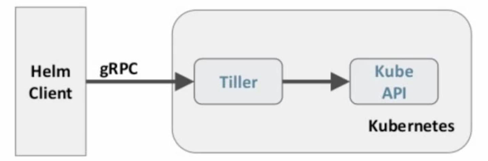

> Helm客户端负责chart和release的创建和管理以及和Tiller的交互。Tiller服务器运行在k8s集群中，它会处理Helm客户端的请求，与k8s API Server进行交互。

### helm 用途

做为`Kubernetes`的一个包管理工具，Helm具有如下功能：

- 创建新的`chart`

- `chart`打包成`tgz`格式

- 上传`chart`到`chart`仓库或从仓库中下载 `chart`

  - 官方`chart`仓库是: [https://hub.helm.sh](https://hub.helm.sh/)
- 在`Kubernetes`集群中安装或卸载`chart`

- 用`Helm`管理安装的`chart`的发布周期

## helm 部署

- 注意：这里安装的是`helm v3.2.4`，如需下载更新的版本，可以至github官方repo选择

> 官方下载地址：https://github.com/helm/helm/releases

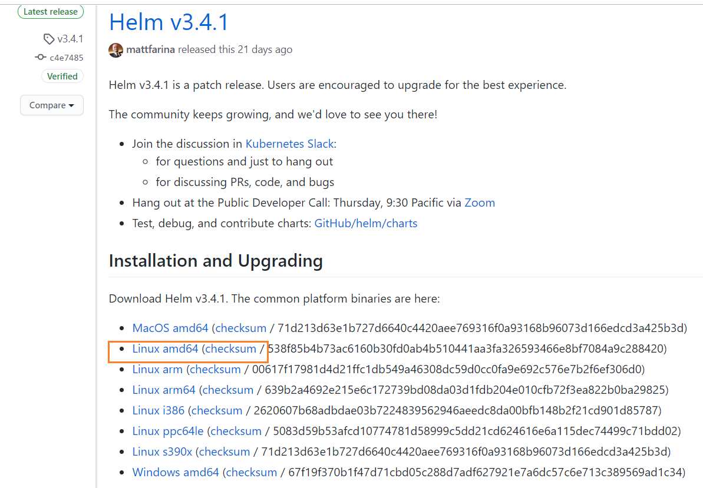

```shell
# 如无需更换版本，直接执行下载
wget https://get.helm.sh/helm-v3.2.4-linux-amd64.tar.gz

# 解压
tar -zxvf helm-v3.2.4-linux-amd64.tar.gz

# 进入到解压后的目录
cd linux-amd64/

# 移动
cp helm /usr/local/bin/

# 查看版本
helm version
```

## helm 详解

可以直接使用官方的chart仓库或者其他仓库来安装一些`chart`

> [https://hub.helm.sh](https://hub.helm.sh/)
>
> `chart仓库：`https://artifacthub.io/

### helm 使用

**以官方仓库的一个redis为例**

1. 访问 `Helm` 仓库：https://artifacthub.io/
2. 搜索需要的包
3. 按照 `install` 步骤操作即可

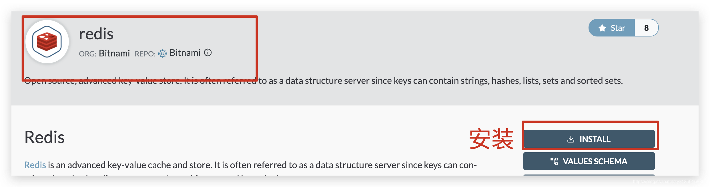

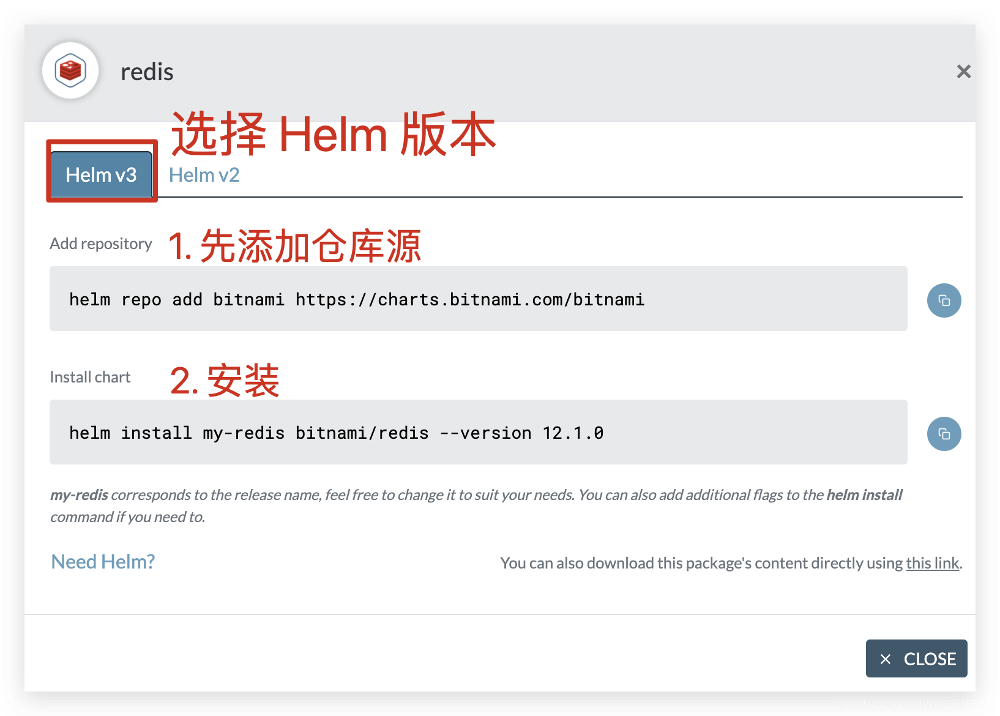

### helm 自定义模板

#### 文件目录结构

```sh
.
├── Chart.yaml
├── templates
│   ├── deployment.yaml
│   └── service.yaml
└── values.yaml
```

#### 自定义chart的示例

**第一步: 准备自定义chart相关文件**

```shell
# 1. 新建myapp文件夹存放chart
[root@k8s-master01 ~]# mkdir myapp
[root@k8s-master01 ~]# cd myapp/
```

```shell
# 2. 新建Chart.yaml
cat << EOF > Chart.yaml
name: hello-world
version: 1.0.0
EOF
```

```shell
# 3. 新建./templates/deployment.yaml
[root@k8s-master01 myapp]# mkdir templates
cat <<'EOF' > ./templates/deployment.yaml
apiVersion: extensions/v1beta1
kind: Deployment
metadata:
  name: hello-world
spec:
  replicas: 1
  template:
    metadata:
      labels:
        app: hello-world
    spec:
      containers:
        - name: hello-world
          image: {{ .Values.image.repository }}:{{ .Values.image.tag }}
          ports:
            - containerPort: 80
              protocol: TCP
EOF
```

```shell
# 4. 新建./templates/service.yaml
cat <<'EOF' > ./templates/service.yaml
apiVersion: v1
kind: Service
metadata:
  name: hello-world
spec:
  type: NodePort
  ports:
    - port: 80
      targetPort: 80
      protocol: TCP
  selector:
    app: hello-world
EOF
```

```shell
# 5. 新建values.yaml
cat <<'EOF' > ./values.yaml
image:
  repository: qianzai/k8s-myapp
  tag: 'v1'
EOF
```

**第二步: 使用上面的自定义chart**

```shell
# 将chart实例化成release
# 格式：helm install [RELEASE-NAME] [CHART-PATH]
helm install testname .

# 查看release
helm ls

# 安装成功！！
```

#### helm 命令详解

###### helm install

`helm install`——chart 安装

```shell
helm install [NAME] [CHART] [flags]
```

- `-f, --values`：指定 `values.yaml` 文件
- `--set`：在命令行中直接设置 `values` 的值
- `--dry-run`：模拟执行，测试能不能创建，但不创建
- `--debug`：允许冗长的输出（输出多余信息）

###### helm upgrade

helm upgrade——chart 升级为一个新版本

```shell
helm upgrade [RELEASE] [CHART] [flags]
```

> 发现helm v2，v3 版本不一样，命令差别挺大，详细请查看官方文档：https://helm.sh/zh/docs/helm/

## Helm 部署 dashboard

```shell
# 1.添加仓库
helm repo add k8s-dashboard https://kubernetes.github.io/dashboard

# 2.下载 Chart
helm pull kubernetes-dashboard/kubernetes-dashboard
tar -zxvf kubernetes-dashboard

# 3. 创建 kubernetes-dashboard.yaml
```

`kubernetes-dashboard.yaml`

```yaml
image:
  repository: kubernetesui/dashboard
  tag: v2.0.4
ingress:
  enabled: true
  hosts:
    - k8s.frognew.com
  annotations:
    nginx.ingress.kubernetes.io/ssl-redirect: "true"
    nginx.ingress.kubernetes.io/backend-protocol: "HTTPS"
  tls:
    - secretName: frognew-com-tls-secret
      hosts:
        - k8s.frognew.com
rbac:
  clusterAdminRole: true
```

```shell
# 4.安装
helm install kubernetes-dashboard . \
--namespace kube-system \
-f kubernetes-dashboard.yaml

# 5. 更改 svc
$ kubectl edit svc kubernetes-dashboard -n kube-system
将 spec.type 的值修改为 NodePort

# 查看端口（端口为：30354）
$ kubectl get svc -n kube-system
NAME                   TYPE        CLUSTER-IP       EXTERNAL-IP   PORT(S)                  AGE
kubernetes-dashboard   NodePort    10.102.46.217   <none>        443:32671/TCP            4m46s
```

最后访问地址：https://192.168.200.61:32671

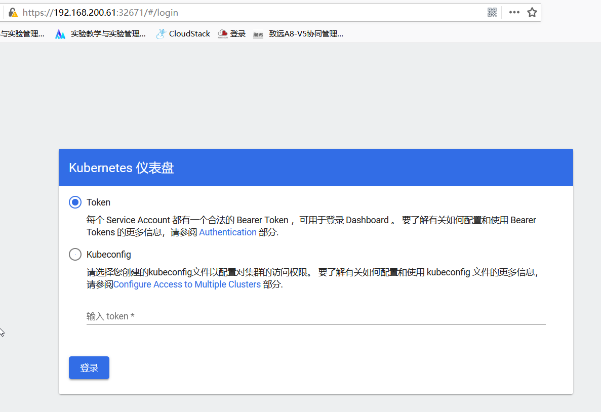

> 可以发现有两种方式验证，下面查看token方式

```shell
# 查看 kubernetes-dashboard-token
 kubectl get secret -n kube-system | grep kubernetes-dashboard-token
 
 kubectl describe secret -n kube-system kubernetes-dashboard-token-bqtxz
```

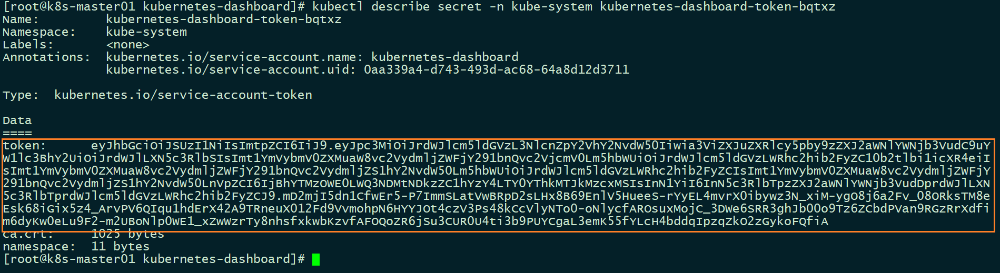

> 将token复制进去，即可登录成功

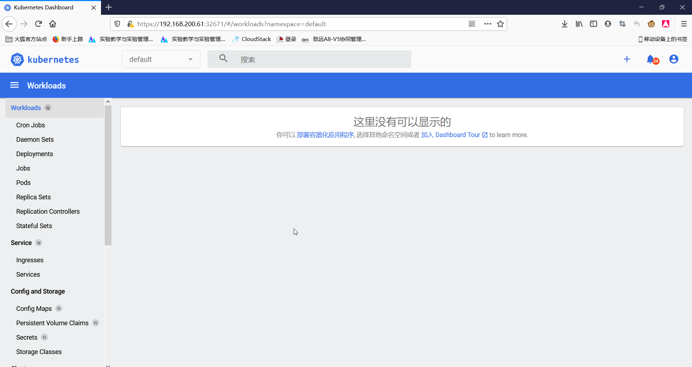

> 登录成功后，进去界面，发现什么资源都显示不了，是因为 `dashboard` 默认的 `serviceaccount` 并没有权限，所以我们需要给予它授权。

创建 `dashboard-admin.yaml`

```yaml
apiVersion: rbac.authorization.k8s.io/v1
kind: ClusterRoleBinding
metadata:
  name: kubernetes-dashboard
  namespace: kube-system
subjects:
  - kind: ServiceAccount
    name: kubernetes-dashboard
    namespace: kube-system
roleRef:
  apiGroup: rbac.authorization.k8s.io
  kind: ClusterRole
  name: cluster-admin
```

```shell
[root@k8s-master01 ~]# kubectl apply -f dashboard-admin.yaml 
clusterrolebinding.rbac.authorization.k8s.io/kubernetes-dashboard created
```

> 授权成功，就可以查看到资源了

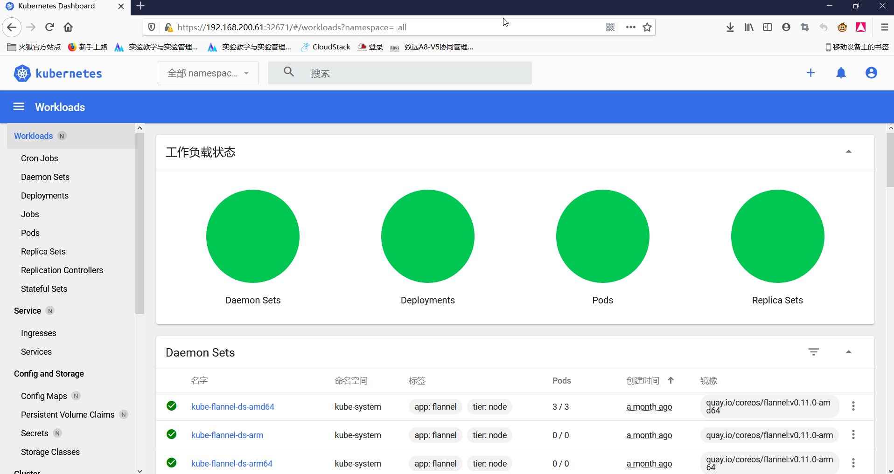

## Helm 部署 Prometheus

Prometheus github 地址：https://github.com/coreos/kube-prometheus

### Prometheus 简介

`Prometheus`是一个开放性的监控解决方案，用户可以非常方便的安装和使用Prometheus并且能够非常方便的对其进行扩展。为了能够更加直观的了解Prometheus Server，接下来我们将在本地部署并运行一个Prometheus Server实例，通过Node Exporter采集当前主机的系统资源使用情况。 并通过Grafana创建一个简单的可视化仪表盘。

### 组件说明


1. `MetricServer`：是 kubernetes 集群资源使用情况的聚合器，收集数据给 kubernetes 集群内使用，如 kubectl,hpa,scheduler 等。
2. `PrometheusOperator`：是一个系统监测和警报工具箱，用来存储监控数据。
3. `NodeExporter`：用于各 node 的关键度量指标状态数据。
4. `KubeStateMetrics`：收集 kubernetes 集群内资源对象数据，制定告警规则。
5. `Prometheus`：采用 pull 方式收集 apiserver，scheduler，controller-manager，kubelet 组件数据，通过 http 协议传输。
6. `Grafana`：是可视化数据统计和监控平台。


### 安装部署

**1、安装 kube-prometheus**

这里要注意一下版本兼容问题，在[官网](https://github.com/prometheus-operator/kube-prometheus/tags)下载对应的版本即可

| be-prometheus stack | Kubernetes 1.14 | Kubernetes 1.15 | Kubernetes 1.16 | Kubernetes 1.17 | Kubernetes 1.18 | Kubernetes 1.19 |
| ------------------- | --------------- | --------------- | --------------- | --------------- | --------------- | --------------- |
| lease-0.3           | ✔               | ✔               | ✔               | ✔               | ✗               | ✗               |
| lease-0.4           | ✗               | ✗               | ✔               | (v1.16.5+) ✔    | ✗               | ✗               |
| lease-0.5           | ✗               | ✗               | ✗               | ✗               | ✔               | ✗               |
| lease-0.6           | ✗               | ✗               | ✗               | ✗               | ✔               | ✔               |
| AD                  | ✗               | ✗               | ✗               | ✗               | ✗               | ✔               |

```shell
# 克隆相应的分支
git clone -b release-0.3 https://github.com/coreos/kube-prometheus.git

cd kube-prometheus/manifests
```

**2、修改 `grafana-service.yaml`：**

```yaml
apiVersion: v1
kind: Service
metadata:
  name: grafana
  namespace: monitoring
spec:
  type: NodePort	# 添加内容
  ports:
    - name: http
    port: 3000
    targetPort: http
    nodePort: 30100 #添加内容
  selector:
    app: grafana
```

**3、修改 `prometheus-service.yaml`：**

```yaml
apiVersion: v1
kind: Service
metadata:
  labels:
    prometheus: k8s
  name: prometheus-k8s
  namespace: monitoring
spec:
  type: NodePort	# 添加
  ports:
    - name: web
      port: 9090
      targetPort: web
      nodePort: 30200	# 添加
  selector:
    app: prometheus
    prometheus: k8s
  sessionAffinity: ClientIP
```

**4、修改 `alertmanager-service.yaml`：**

```yaml
apiVersion: v1
kind: Service
metadata:
  labels:
    alertmanager: main
  name: alertmanager-main
  namespace: monitoring
spec:
  type: NodePort	# 添加
  ports:
    - name: web
      port: 9093
      targetPort: web
      nodePort: 30300	# 添加
  selector:
    alertmanager: main
    app: alertmanager
  sessionAffinity: ClientIP
```

**5、安装**

```shell
# 在 kube-prometheus/manifests 目录下执行
# 创建名称空间，prometheus 组件都在这个名称空间下
kubectl create namespace monitoring

# 这两个目录下的 yaml 都要创建
kubectl apply -f ./setup
kubectl apply -f .
```

> 在国内，镜像容易拉取失败

**6、`kubectl top` 命令查看集群资源**

```shell
$ kubectl top node
NAME           CPU(cores)   CPU%   MEMORY(bytes)   MEMORY%   
k8s-master01   1500m        75%    1142Mi          60%       
k8s-node01     1691m        84%    946Mi           50%       
k8s-node02     1411m        70%    912Mi           48% 

$ kubectl top pod -n monitoring
NAME                                  CPU(cores)   MEMORY(bytes)
alertmanager-main-0                   2m           21Mi
alertmanager-main-1                   2m           22Mi
```

### 访问 prometheus

```shell
$ kubectl get svc -o wide -n monitoring
NAME                    TYPE        CLUSTER-IP       EXTERNAL-IP   PORT(S)                   
prometheus-k8s          NodePort    10.97.67.69      <none>        9090:30200/TCP               7m31s   app=prometheus,prometheus=k8s
```

> 根据前面安装时候的配置，`prometheus` 对应的 `nodeport` 端口为 `30200`，访问 `http://MasterIP:30200`

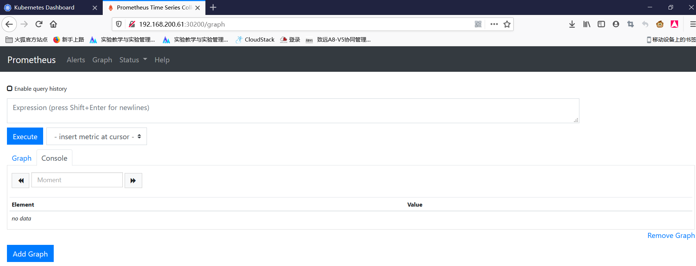

**1、查看 prometheus 的节点状态：**

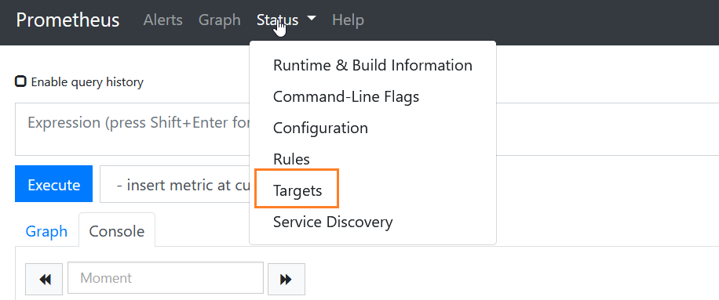

**2、测试查询**

prometheus 的 WEB 界面上提供了基本的查询 K8S 集群中每个 Pod 的 CPU 使用情况，查询条件如下：

```sql
sum by (pod_name)( rate(container_cpu_usage_seconds_total{image!="", pod_name!=""}[1m] ) )
```

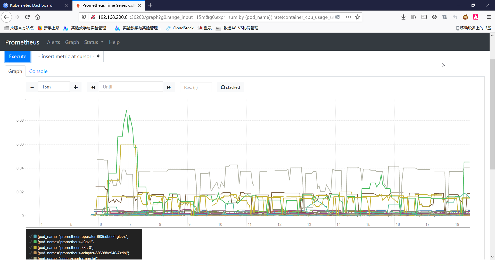

上述的查询有出现数据，说明 `node-exporter` 往 `prometheus` 中写入数据正常，接下来我们就可以部署 `grafana` 组件，实现更友好的 `webui` 展示数据了

> `prometheus` 对系统时间的要求比较高，要确保 k8s 每个节点的时间都同步。通过阿里云服务器同步中国上海时间：`ntpdate ntp1.aliyun.com`

### 访问 grafana

查看 grafana 服务暴露的端口号：

```shell
$ kubectl get service -n monitoring | grep grafana
grafana                 NodePort    10.100.227.242   <none>        3000:30100/TCP               21m
```

如上可以看到 `grafana` 的端口号是 `30100`，浏览器访问：`http://MasterIP:30100`，用户名密码默认 `admin/admin`，第一次登录后会要求修改密码。

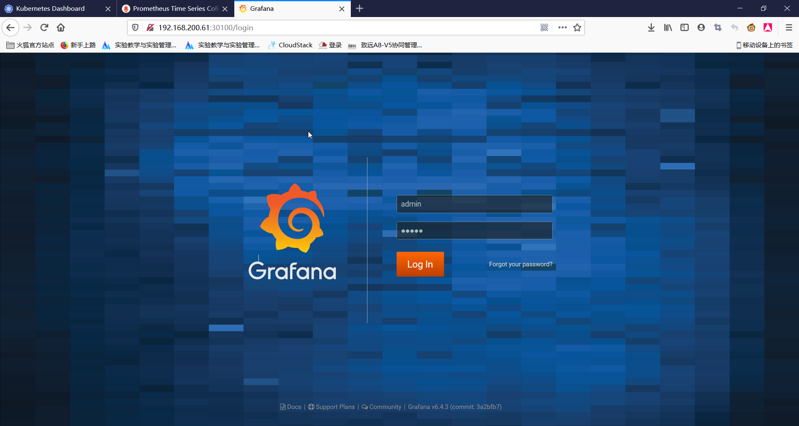

**1、添加数据源**

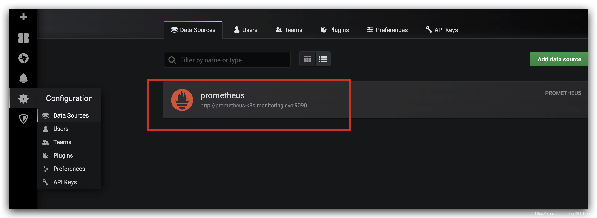

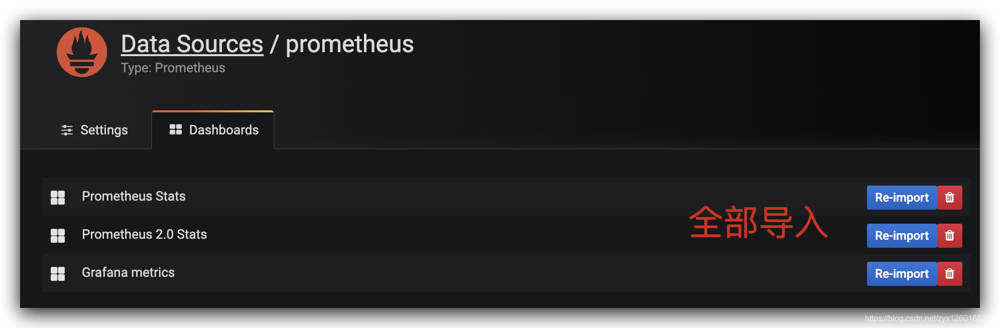

**2、查看节点**

点击 Home，选择监控的对象，这里选择 Nodes

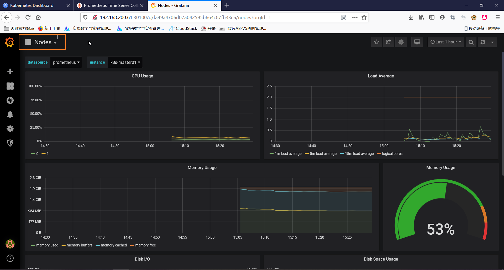


## Horizontal Pod Autoscaling（HPA）

`HPA` 的全称为（Horizontal Pod Autoscaling）它可以根据当前 `pod` 资源的使用率（如 CPU、磁盘、内存等），进行副本数的动态的扩容与缩容，以便减轻各个 `pod` 的压力。当 `pod` 负载达到一定的阈值后，会根据扩缩容的策略生成更多新的 `pod` 来分担压力，当 `pod`的使用比较空闲时，在稳定空闲一段时间后，还会自动减少 `pod` 的副本数量。

若要实现自动扩缩容的功能，还需要部署 `heapster` 服务，用来收集及统计资源的利用率，支持 `kubectl top` 命令，`heapster` 服务集成在 `prometheus`（普罗米修斯） `Mertric Server` 服务中，所以说，要先安装 `prometheus`。

官方文档：https://kubernetes.io/docs/tasks/run-application/horizontal-pod-autoscale-walkthrough/


## 其他

[玩K8S不得不会的HELM](https://zhuanlan.zhihu.com/p/79046244)

[prometheus-book](https://yunlzheng.gitbook.io/prometheus-book/)

